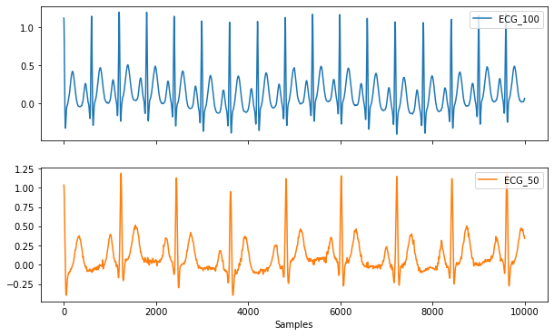

## Project background

### Purpose of project

Ambitious athletes should be provided with precise and reliable performance data. This should enable the athletes to further enhance their performance. 

### Scope of project

Athletes will provide the system with data recorded by an ergometer. The generated data from the test procedure consists of a three-minute performance test with a fixed performance goal. Heartrate and performance over time are thereby recorded and stored separately.

### Other background information

...

## Perspectives
### Who will use the system?

Athletes will use the system to assess their performance through a standardised performance testing procedure. Diagnosticians will use the system to process the athletes data. That includes manually defining the scope of the testing procedure as well as visualizing the athletes data and storing it in the right location.

### Who can provide input about the system?

Athletes are providing the ergometer with input. The system then interprets the input from the ergometer and redirects them to a defined interface. Diagnosticians will have the ability to manipulate the framework conditions thus influencing the process of visualizing and storing the athletes data.

## Project Objectives
### Known business rules

none

### System information and/or diagrams

Example of recorded ECG data

The heart rate must be determined from this.

### Assumptions and dependencies

The system does have external dependencies from the ergometer as well as from the diagnostician.
The diagnostician has to initiate the test procedure via the command line as there is no user interface yet.
The ergometer has to provide the system with data.

#### What information is included in the data?

The Input-Data includes three different data sets for each test person ( subject). The First data set is called "ecg_data_subject_#number.csv". It shows a large amount of ECG data from the test subjects. The second set. "power_data_<number>.txt" shows the performce of each subject over time ( 3 minutes). The third and last data set: "subject_<number>.json" shows general information about the subjects: the id-number, their generated power in watt, the birth year and the duration of the test.

#### How is the data resolved in time and how long are the performance tests?

Each performance test lasted 3 minutes (180 seconds). The power data shows the performance in watt achieved in every second of the test, that means 180 values per subject. The First subject reached 100 watt on average, the second subject 200 watt and the third subject 300 watt. 

NOTE-JHU: Passt. <placeholder> ist eine üblichere Notation als # 

### Design and implementation constraints

- Until a user interface is established the system is operated via the command line. 
- Athlete data includes their name, a technical ID as well as their date of birth. 
- The plots and the processed data are to be stored together.
- Successful and aborted attempts are to be stored in separate folders.

## Risks

## Known future enhancements

Implementing a user interface.

## References

- [Link zur Aufgabenstellung](tbd)

## Open, unresolved or TBD issues

...
